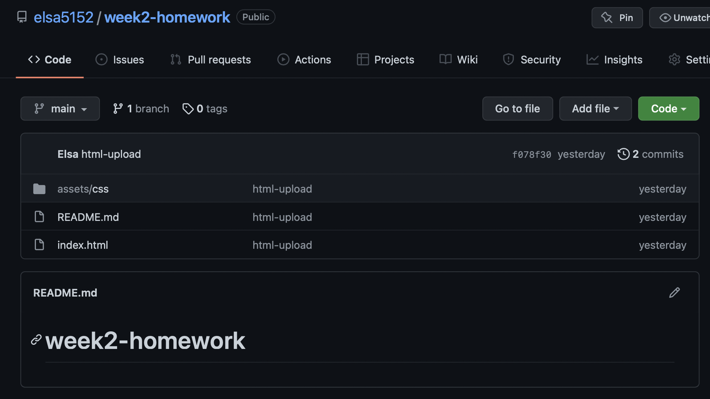
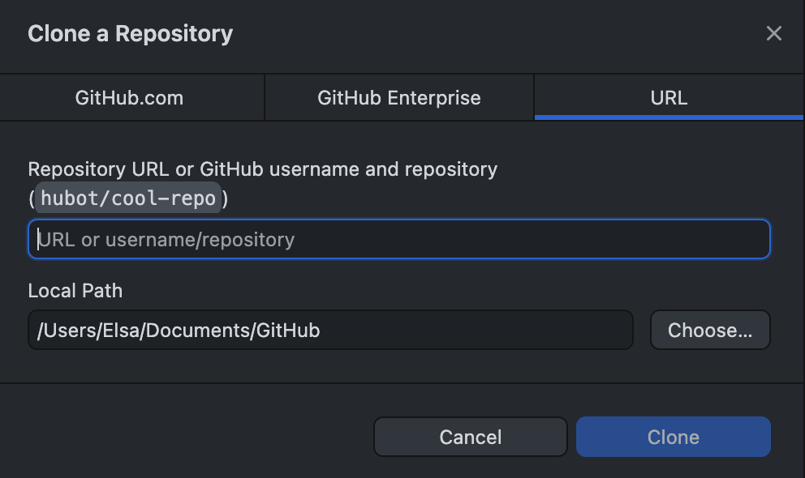
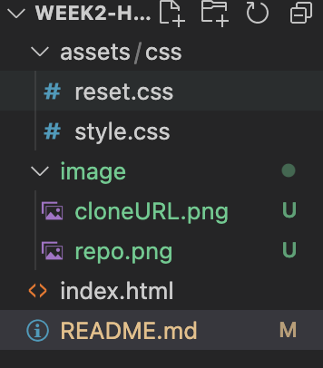
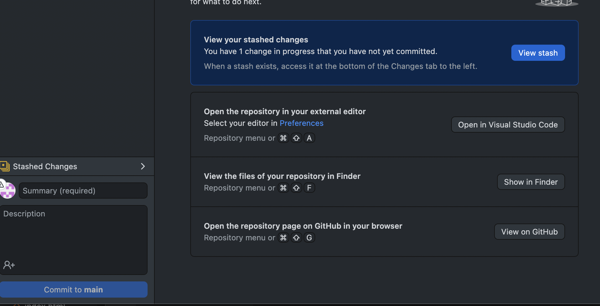

# week2-homework

This is the detail for week2-homework.

* Create a new repository on my Github account and creat a README.md file.

* Clone all the file form Gitlab to my Github account.

* Create all the working file and folder in vs Code.

* Write the code in vs Code and upload it by gitpush.

* Update to the repo

## Link my homework

[Horiseon-page](https://elsa5152.github.io/fistweek-homework/#search-engine-optimization)